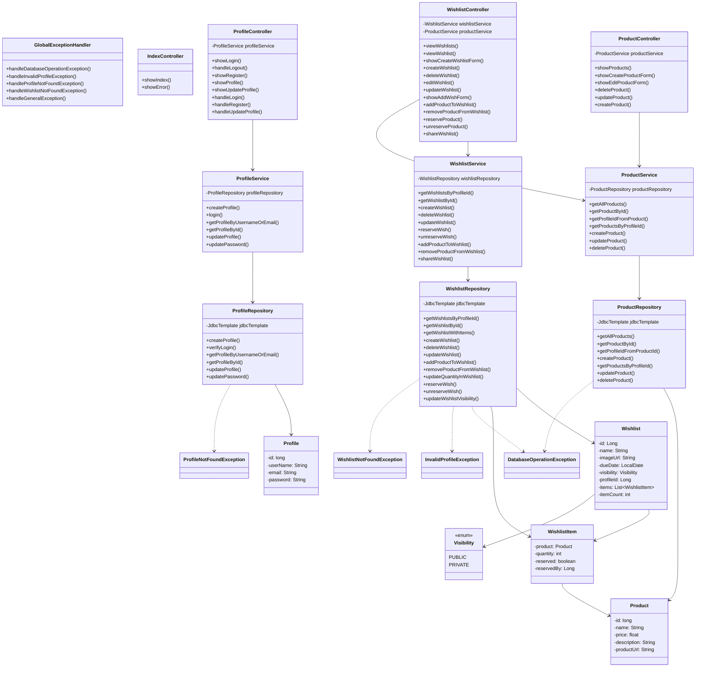

```mermaid
classDiagram


%% CONTROLLERS

class GlobalExceptionHandler {
    +handleDatabaseOperationException()
    +handleInvalidProfileException()
    +handleProfileNotFoundException()
    +handleWishlistNotFoundException()
    +handleGeneralException()
}

class IndexController {
    +showIndex()
    +showError()
}

class ProductController {
    -ProductService productService
    +showProducts()
    +showCreateProductForm()
    +showEditProductForm()
    +deleteProduct()
    +updateProduct()
    +createProduct()
}

class ProfileController {
    -ProfileService profileService
    +showLogin()
    +handleLogout()
    +showRegister()
    +showProfile()
    +showUpdateProfile()
    +handleLogin()
    +handleRegister()
    +handleUpdateProfile()
}

class WishlistController {
    -WishlistService wishlistService
    -ProductService productService
    +viewWishlists()
    +viewWishlist()
    +showCreateWishlistForm()
    +createWishlist()
    +deleteWishlist()
    +editWishlist()
    +updateWishlist()
    +showAddWishForm()
    +addProductToWishlist()
    +removeProductFromWishlist()
    +reserveProduct()
    +unreserveProduct()
    +shareWishlist()
}


%% SERVICES

class ProductService {
    -ProductRepository productRepository
    +getAllProducts()
    +getProductById()
    +getProfileIdFromProduct()
    +getProductsByProfileId()
    +createProduct()
    +updateProduct()
    +deleteProduct()
}

class ProfileService {
    -ProfileRepository profileRepository
    +createProfile()
    +login()
    +getProfileByUsernameOrEmail()
    +getProfileById()
    +updateProfile()
    +updatePassword()
}

class WishlistService {
    -WishlistRepository wishlistRepository
    +getWishlistsByProfileId()
    +getWishlistById()
    +createWishlist()
    +deleteWishlist()
    +updateWishlist()
    +reserveWish()
    +unreserveWish()
    +addProductToWishlist()
    +removeProductFromWishlist()
    +shareWishlist()
}


%% REPOSITORIES

class ProductRepository {
    -JdbcTemplate jdbcTemplate
    +getAllProducts()
    +getProductById()
    +getProfileIdFromProductId()
    +createProduct()
    +getProductsByProfileId()
    +updateProduct()
    +deleteProduct()
}

class ProfileRepository {
    -JdbcTemplate jdbcTemplate
    +createProfile()
    +verifyLogin()
    +getProfileByUsernameOrEmail()
    +getProfileById()
    +updateProfile()
    +updatePassword()
}

class WishlistRepository {
    -JdbcTemplate jdbcTemplate
    +getWishlistsByProfileId()
    +getWishlistById()
    +getWishlistWithItems()
    +createWishlist()
    +deleteWishlist()
    +updateWishlist()
    +addProductToWishlist()
    +removeProductFromWishlist()
    +updateQuantityInWishlist()
    +reserveWish()
    +unreserveWish()
    +updateWishlistVisibility()
}

%% MODELS

class Product {
    -id: long
    -name: String
    -price: float
    -description: String
    -productUrl: String
}

class Profile {
    -id: long
    -userName: String
    -email: String
    -password: String
}

class Wishlist {
    -id: Long
    -name: String
    -imageUrl: String
    -dueDate: LocalDate
    -visibility: Visibility
    -profileId: Long
    -items: List~WishlistItem~
    -itemCount: int
}

class WishlistItem {
    -product: Product
    -quantity: int
    -reserved: boolean
    -reservedBy: Long
}

class Visibility {
    <<enum>>
    PUBLIC
    PRIVATE
}


%% EXCEPTIONS

class DatabaseOperationException
class InvalidProfileException
class ProfileNotFoundException
class WishlistNotFoundException


%% RELATIONSHIPS


%% Controller -> Service

ProductController --> ProductService
ProfileController --> ProfileService
WishlistController --> WishlistService
WishlistController --> ProductService

%% Service -> Repository

ProductService --> ProductRepository
ProfileService --> ProfileRepository
WishlistService --> WishlistRepository

%% Repository -> Model

ProductRepository --> Product
ProfileRepository --> Profile
WishlistRepository --> Wishlist
WishlistRepository --> WishlistItem
WishlistItem --> Product

%% Wishlist relation

Wishlist --> WishlistItem
Wishlist --> Visibility

%% Exceptions usage

ProductRepository ..> DatabaseOperationException
WishlistRepository ..> DatabaseOperationException
WishlistRepository ..> InvalidProfileException
WishlistRepository ..> WishlistNotFoundException
ProfileRepository ..> ProfileNotFoundException
```
