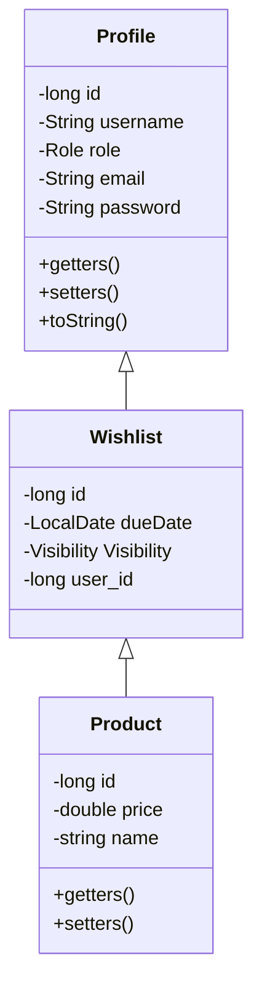

```mermaid
classDiagram
    Profile <|-- Wishlist
    Wishlist <|-- Product
    
    class Profile {
        -long id
        -String username
        -Role role
        -String email
        -String password
        +getters()
        +setters()
        +toString()
    }

    class Wishlist{
      -long id
      -LocalDate dueDate
      -Visibility Visibility
      -long user_id
    }
    class Product{
      -long id
      -double price
      -string name
      +getters()
      +setters()
    }
```
