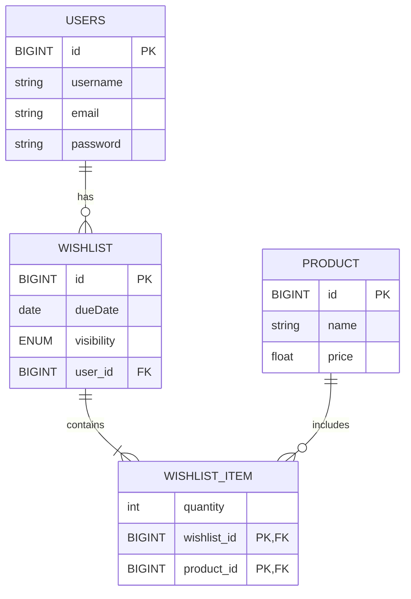

```mermaid
erDiagram
    USERS ||--o{ WISHLIST : has
    WISHLIST ||--|{ WISHLIST_ITEM : contains
    PRODUCT ||--o{ WISHLIST_ITEM : includes
    USERS {
        BIGINT id PK
        string username
        string email
        string password
    }
    WISHLIST {
        BIGINT id PK
        date dueDate
        ENUM visibility
        BIGINT user_id FK
    }
    PRODUCT {
        BIGINT id PK
        string name
        float price
    }
    WISHLIST_ITEM {
        int quantity
        BIGINT wishlist_id PK,FK
        BIGINT product_id PK,FK
    }
```
