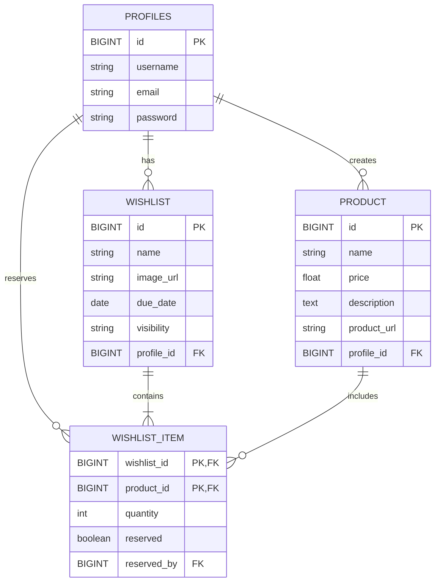

```mermaid
erDiagram
    PROFILES ||--o{ WISHLIST : has
    PROFILES ||--o{ PRODUCT : creates
    PROFILES ||--o{ WISHLIST_ITEM : reserves
    WISHLIST ||--|{ WISHLIST_ITEM : contains
    PRODUCT ||--o{ WISHLIST_ITEM : includes

    PROFILES {
        BIGINT id PK
        string username
        string email
        string password
    }
    WISHLIST {
        BIGINT id PK
        string name
        string image_url
        date due_date
        string visibility
        BIGINT profile_id FK
    }
    PRODUCT {
        BIGINT id PK
        string name
        float price
        text description
        string product_url
        BIGINT profile_id FK
    }
    WISHLIST_ITEM {
        BIGINT wishlist_id PK,FK
        BIGINT product_id PK,FK
        int quantity
        boolean reserved
        BIGINT reserved_by FK
    }
```
